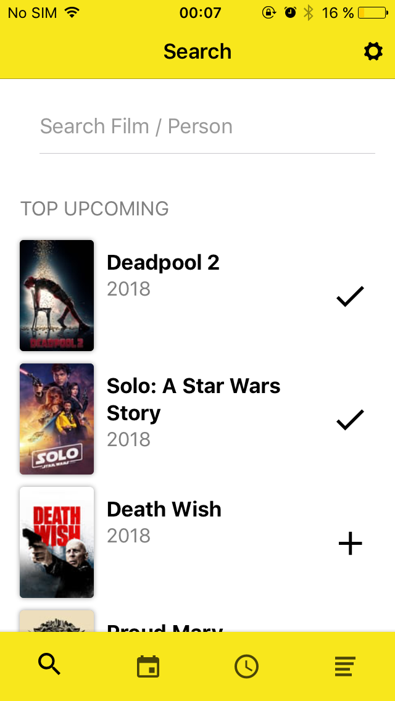
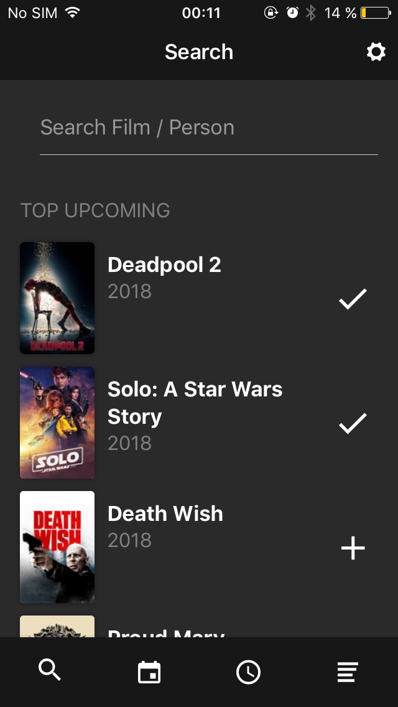
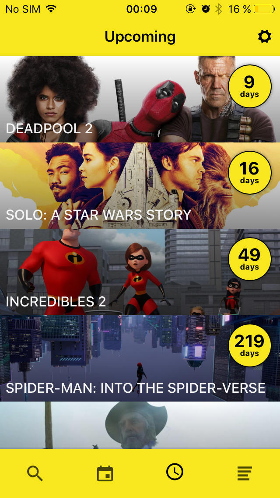
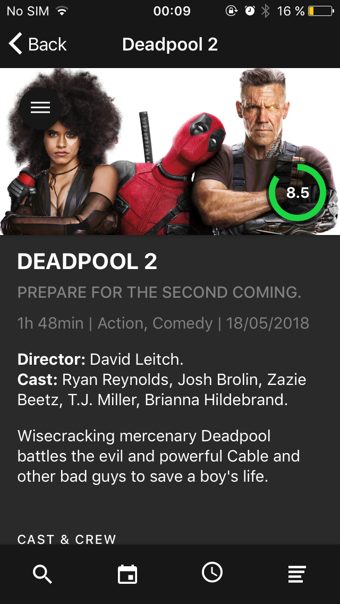
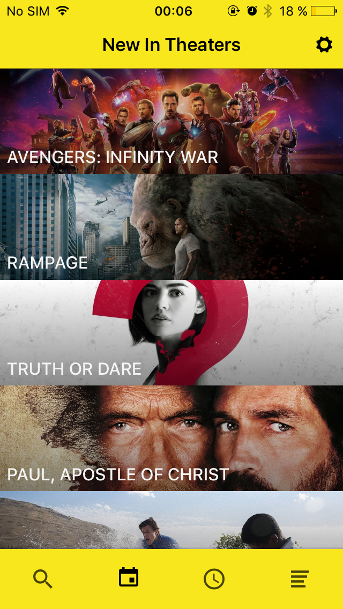
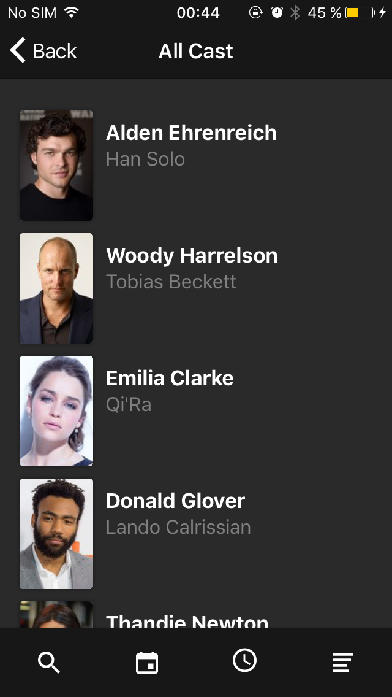
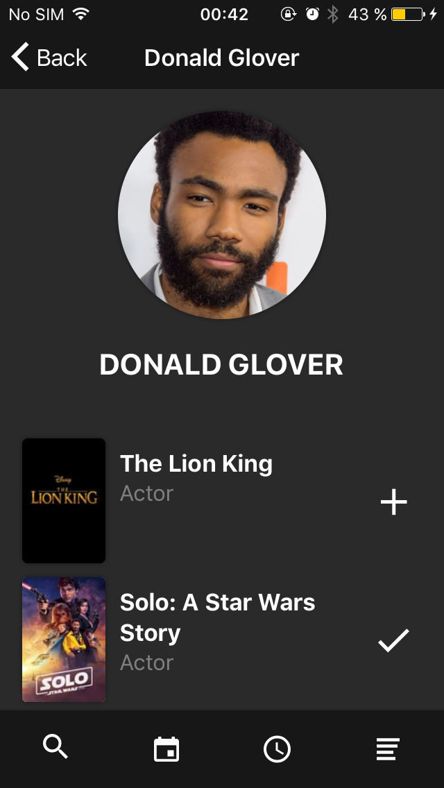
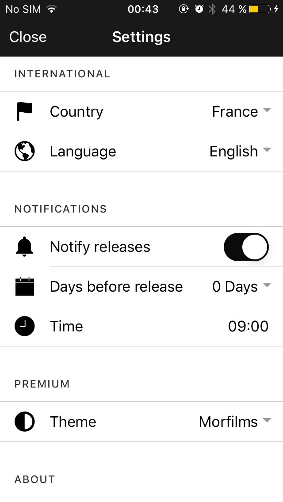

# Morfilms

Morfilms helps you organise your upcoming movies list and checks for you how many days are left for each film to be released in your country. You can also schedule notifications so you won't miss any film you want to see!

Feature list:
- Search new films (or profiles) and see the top upcoming in your country.
- Browse films that are playing in theaters now.
- Add films to your watchlist: you will see how many days are left for it to be released, if known. 
- You can also add old movies and use it as a simple watchlist.
- Film details: length, genres, release date, cast and crew, imdb link, trailer and showtimes using google cards. 
- Share films with [morfilms.link](https://morfilms.github.io/movie/?l=en&c=ES&m=313369), you can also open these links in-app and add films to your watchlist in one click.
- English and Spanish language. Tons of countries available (you can add your own adding one line of code!).
- Customizable release notifications.
- Beautiful (and not so beautiful) themes.
- Free to use with no ads.

   
   

## How to install
1. Install [nodejs+npm](https://nodejs.org/en/), [ionic](https://ionicframework.com/getting-started) and [cordova](https://cordova.apache.org).
2. Go to the project folder and install node modules.
> npm install
3. Add the platform you need.
> ionic cordova platform add [ios/android]
4. You need your own [themoviedb api key](https://www.themoviedb.org/faq/api?language=en). Replace *src/providers/tmdb.ts* - API_KEY wit it.
5. Build your project.
> ionic cordova build [ios/android]
6. Your ios build will generate an xcode project (*platforms/ios*), open and run it.
7. The android apk is located at *platforms/android*

## About
I made morfilms as a simple app for me to organise films that I wanted to watch...

If you like the project you can support me downloading official Morfilms release from the store on [iOS](https://itunes.apple.com/us/app/morfilms-upcoming-movies-list/id1207671266?ls=1&mt=8) and [Android](https://play.google.com/store/apps/details?id=eu.morfilms.watchlist). It's free with ads, but you can disable ads (and unlock themes) if you buy Morfilms Premium as an in-app-purchase.
